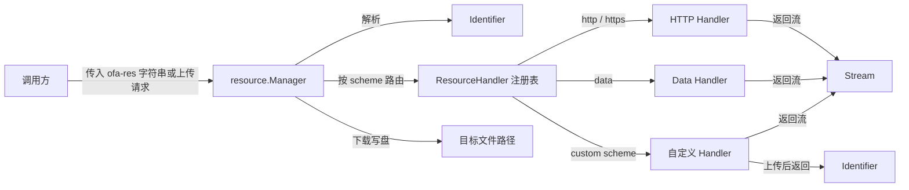
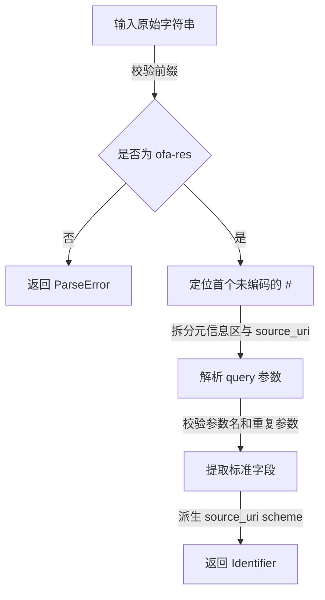
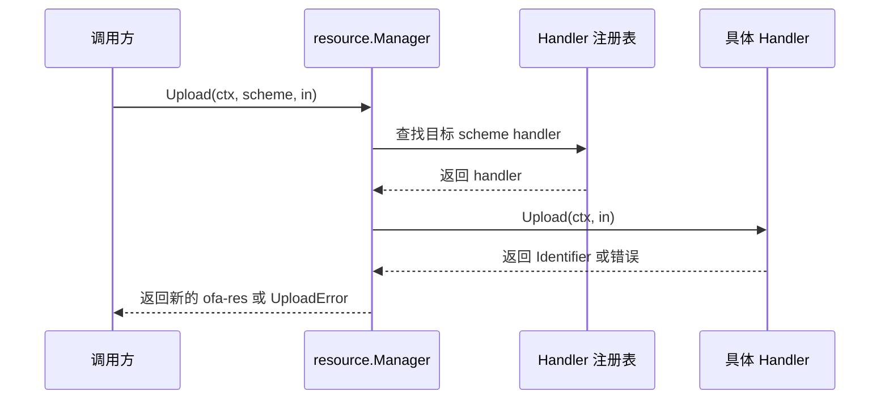

# resource 包技术设计

## 1. 背景与目标

`resource` 包为 `ofa-res` 资源标识符提供统一的 Go 侧处理入口，解决“如何解析、打开、下载和上传资源”这条主链路，而不扩展成资源中台。

- 关联文档：
  - [`docs/spec/resource/spec.md`](../spec/resource/spec.md)
  - [`README.md`](../../README.md)
  - [`docs/technical-design-template.md`](../technical-design-template.md)
- 当前背景：
  - `docs/spec/resource/spec.md` 已定义资源标识符格式 `ofa-res[?<param>=<value>&...]#<source_uri>`。
  - 当前仓库尚未提供对应的 `resource` Go 包实现，调用方仍需自行处理解析、网络访问、下载、上传和自定义 scheme 扩展。
- 本次目标：
  - 提供 `Parse`、`Open`、`Download` 三类核心能力，以及 `Upload` 扩展接口。
  - 默认支持 `http`、`https`、`data` 三种标准 scheme 的读取与下载能力。
  - 允许调用方按 scheme 注册自定义处理器。
  - 在默认实现中承担必要的大小限制、超时、重定向限制，以及受 timeout quota 约束的重试控制。
- 非目标：
  - 不在首版实现默认上传处理器、转存平台、资源生命周期管理、转码和归档。
  - 不定义跨语言统一 SDK API，只描述当前 `core-go` 的包设计。
  - 不为所有私有 scheme 预置认证模型或内置实现。
  - 不要求业务协议改为传递结构化资源对象；业务侧仍以字符串标识符为准。
- 设计前提：
  - 跨语言兼容规则继续以 [`docs/spec/resource/spec.md`](../spec/resource/spec.md) 为准。
  - 本文档只给出 Go 落地设计，不反向改写 spec。
  - 首版虽然支持 `http`、`https` 下载，但 SSRF 防护暂不在本轮实现闭环内；因此首版更适合受控输入或受信任来源，不应宣称已经完整满足开放 URL 下载场景下的安全要求。

## 2. 方案设计

### 2.1 模块边界与核心概念

#### 模块职责

- 解析 `ofa-res` 字符串并提取标准参数与 `source_uri`。
- 按 `source_uri` 的 scheme 将请求路由到对应处理器。
- 为 `http`、`https`、`data` 提供默认读取与下载能力。
- 返回流式读取结果，将内容安全写入调用方给定路径，或将输入内容上传后返回新的资源标识符。
- 在默认实现中执行大小限制、超时、重定向限制，以及符合 `docs/spec/resilience/spec.md` 的 timeout quota 和重试约束。

#### 非职责边界

- 不抽象统一资源存储模型。
- 不解释 `auth_id` 对应的具体凭据格式；它只作为处理器可消费的认证上下文。
- 不定义业务协议中的字段命名；这由 spec 决定。
- 不承诺“把任意外部 URL 自动转存为内部资源标识符”这类更高层能力。
- 不要求所有 scheme 都天然支持上传；是否支持上传由具体处理器声明和保证。

#### 核心对象

| 名称 | 角色或职责 | 是否公开 |
| --- | --- | --- |
| `Identifier` | `ofa-res` 的解析结果，包含标准参数、扩展参数和 `source_uri` 派生信息 | 是 |
| `Manager` | 统一入口，负责路由、打开资源流、下载和上传 | 是 |
| `ResourceHandler` | 按 scheme 打开资源或上传资源的扩展点 | 是 |
| `Stream` | 对外返回的资源流句柄，包含 `Body` 和元信息 | 是 |
| `UploadInput` | 上传输入，包含待上传内容、期望媒体类型、文件名等元信息 | 是 |
| `Option` / `Options` | `Manager` 的默认行为配置，例如 HTTP 客户端、timeout quota 和大小限制 | 是 |
| `ParseError` / `OpenError` / `DownloadError` / `UploadError` | 对解析、打开、落盘和上传失败做分类包装 | 是 |

#### 对象关系



#### 核心状态与资源

- `Manager` 持有只读配置和 scheme 到 `ResourceHandler` 的注册表。
- `Stream` 代表单次打开结果，`Body` 由调用方负责关闭。
- `Download` 内部持有临时文件句柄；成功后原子替换目标文件，失败时清理临时文件。
- `Upload` 内部持有单次上传输入流；关闭责任默认由调用方保留，或由 `UploadInput` 明确约定转移方式。

### 2.2 API 语义与兼容边界

#### 公共 API 草案

```go
package resource

type Identifier struct {
	Raw       string
	Params    map[string]string
	SourceURI string
	Scheme    string

	AuthID    string
	MediaType string
	Filename  string
	ExpiresAt string
	SHA256    string
}

type Stream struct {
	Body      io.ReadCloser
	MediaType string
	Filename  string
	Size      int64
	SourceURI string
	Headers   http.Header
}

type ResourceHandler interface {
	Open(ctx context.Context, id Identifier) (*Stream, error)
	Upload(ctx context.Context, in UploadInput) (Identifier, error)
}

type HandlerFuncs struct {
	OpenFunc   func(ctx context.Context, id Identifier) (*Stream, error)
	UploadFunc func(ctx context.Context, in UploadInput) (Identifier, error)
}

func (h HandlerFuncs) Open(ctx context.Context, id Identifier) (*Stream, error)
func (h HandlerFuncs) Upload(ctx context.Context, in UploadInput) (Identifier, error)

type UploadInput struct {
	Body       io.Reader
	MediaType  string
	Filename   string
	AuthID     string
	TargetHint string
}

type Manager struct {
	// 内部持有 options 和 scheme 注册表
}

func Parse(raw string) (Identifier, error)
func NewManager(opts ...Option) *Manager
func (m *Manager) Register(scheme string, handler ResourceHandler) error
func (m *Manager) Open(ctx context.Context, raw string) (*Stream, error)
func (m *Manager) Download(ctx context.Context, raw string, dstPath string) error
func (m *Manager) Upload(ctx context.Context, scheme string, in UploadInput) (Identifier, error)
```

#### API 语义

- `Parse` 只做协议级解析与校验，不触发网络访问和磁盘 IO。
- `NewManager` 返回带默认处理器的统一入口；默认处理器覆盖 `http`、`https`、`data` 的读取与下载能力。
- `Register` 为指定 scheme 注册处理器；scheme 必须非空且为小写。
- `Open` 负责解析、路由并返回 `Stream`，不做落盘。
- `Download` 负责解析、打开并将内容写入 `dstPath`；调用方必须显式给出目标路径。
- `Upload` 负责按目标 scheme 路由上传，并直接返回新的 `Identifier`；首版主要作为自定义 scheme 的扩展接口，内建 scheme 默认不提供上传实现。

#### 输入校验与默认值

- `Parse` 必须校验：
  - 输入是非空字符串。
  - 以 `ofa-res` 开头。
  - 存在第一个未编码的 `#`。
  - 参数名满足 spec 中的 `snake_case` 规则。
  - 同一参数名不重复出现。
- `source_uri` 的 scheme 从 `#` 后原始 URI 派生，不改写 `source_uri`。
- `Download` 不从 `filename` 或 URL path 推导目标路径，避免路径穿越和覆盖歧义。
- `Upload` 显式接收目标 scheme，不从上传内容中隐式推导目标存储位置。
- 默认实现应启用有限超时、重定向限制和大小限制，但具体数值不在本文档中固定。
- 所有默认网络调用都应受当前上下文中的 authoritative deadline 或 remaining timeout 约束；若上下文未携带 quota，则按本地默认 quota 初始化。
- `Download` 首版不默认执行 `sha256` 校验；如调用方需要，可由上层显式开启或自行校验。

#### 错误语义

| 场景 | 错误语义 |
| --- | --- |
| 标识符格式非法 | 返回 `ParseError` |
| scheme 未注册 | 返回 `ErrUnsupportedScheme` 或包装后的 `OpenError` |
| 资源打开失败 | 返回 `OpenError`，包含标识符上下文 |
| 下载失败 | 返回 `DownloadError`，包含目标路径和根因 |
| 上传失败 | 返回 `UploadError`，包含目标 scheme 和根因 |
| scheme 不支持上传 | 返回 `ErrUploadUnsupported` 或包装后的 `UploadError` |
| 大小限制或显式开启后的摘要校验失败 | 返回显式校验错误，不静默降级 |

#### 并发与资源生命周期

- `Parse` 是纯函数，可并发调用。
- `Manager.Open`、`Manager.Download` 和 `Manager.Upload` 设计为可并发调用。
- `Register` 推荐在初始化阶段调用；如果允许运行期注册，内部需要保证并发安全。
- `Open` 返回的 `Stream.Body` 必须由调用方关闭。
- `Download` 内部负责关闭源流和目标文件句柄。
- `Upload` 默认不接管 `UploadInput.Body` 的关闭责任，除非后续 API 明确约定。

#### 超时、传播与重试

- 默认实现应遵循 [`docs/spec/resilience/spec.md`](../spec/resilience/spec.md) 中的 timeout quota 和 retry 约束。
- 网络调用优先从 `ctx` 中获取 authoritative deadline；对外发起请求前，应基于当前时刻计算 remaining timeout。
- 如果处理器调用的是遵循 OFA 规范的下游服务，应传播 `ofa-direct-remaining-timeout-ms`；如果是外部非 OFA 服务，仍需用 remaining timeout 约束本地超时，但不要求注入该 header。
- connect timeout 应单独配置，推荐默认值为 `3s`，且不得大于当前 remaining timeout。
- 重试只允许用于明确幂等或可证明尚未被处理的场景：
  - 默认 `http` / `https` 读取可按 `GET` 的幂等语义进行有限重试。
  - `Upload` 默认不得对未知副作用的写请求自动重试，除非处理器明确声明上传语义幂等，或通过幂等键保证安全。
- 所有重试必须共享同一个 timeout quota，不得为每次尝试重新分配完整 request timeout。
- 当 remaining timeout 已不足以支撑下一次尝试时，必须立即停止重试。

#### 兼容性边界

- 稳定承诺：
  - 按 spec 解析 `ofa-res` 和标准参数。
  - 默认支持 `http`、`https`、`data` 的读取与下载能力。
  - 通过 `ResourceHandler` 提供自定义 scheme 扩展点。
  - `Open` 返回流，`Download` 需要显式目标路径。
  - 统一入口对象命名为 `Manager`，承担读写路由职责。
  - `Upload` 返回 `Identifier`，不额外包装上传结果对象。
- 不承诺：
  - 默认超时、大小限制和重定向次数的具体数值。
  - 错误文本字符串的逐字内容。
  - 内部最终复用 `httpx` 还是直接使用 `net/http`。
  - 所有 scheme 都必须提供上传能力；上传是否受支持取决于具体处理器。
- 待确认：
  - `http` 是否默认启用。

#### 已知安全 TODO

- `http` / `https` 首版先提供基本下载能力，但 SSRF 防护暂未闭环。
- 在补齐 SSRF 前，首版不应默认面向开放外部 URL 输入场景。
- 后续需要补齐的安全项至少包括：
  - 私网、本机、链路本地、云元数据地址拦截。
  - redirect 目标的逐跳复检。
  - 与 transport / dialer 绑定的实际拨号校验，而不是只做字符串级校验。
- 这部分完成后，才能把 `http` / `https` 实现视为对 spec 安全要求的完整落地。

### 2.3 核心流程

#### 解析流程



- `Parse` 将第一个未编码的 `#` 视为分隔符。
- `#` 后内容完整保留到 `Identifier.SourceURI`。
- `source_uri` 内部若包含 `%23`，由底层 URI 语义自行解释，`resource` 包不反向解构路径语义。

#### 打开与下载流程

```mermaid
sequenceDiagram
    participant Caller as 调用方
    participant Manager as resource.Manager
    participant Registry as Handler 注册表
    participant Handler as 具体 Handler
    participant FS as 文件系统

    Caller->>Manager: Open(ctx, raw) / Download(ctx, raw, dstPath)
    Manager->>Manager: Parse(raw)
    Manager->>Registry: 按 Identifier.Scheme 查找 handler
    Registry-->>Manager: 返回 handler
    Manager->>Handler: Open(ctx, id)
    Handler-->>Manager: 返回 Stream 或错误
    alt Open
        Manager-->>Caller: 返回 Stream 或 OpenError
    else Download
        Manager->>FS: 创建临时文件
        Manager->>FS: Write the byte stream and enforce the size check; run digest validation when explicitly enabled
        Manager->>FS: 原子替换 dstPath
        Manager-->>Caller: 返回 nil 或 DownloadError
    end
```

- `Manager.Open` 是统一入口，不向调用方暴露默认 scheme 的分支逻辑。
- `auth_id`、`media_type`、`filename` 等参数通过 `Identifier` 透传给处理器。
- `Download` 使用临时文件，避免中途失败留下不完整目标文件。
- 若目标目录不存在或不可写，应立即失败，不自动创建复杂目录层级。
- 如果打开或下载依赖网络访问，应在每次尝试前重新计算 remaining timeout，并受同一 quota 约束。

#### 上传流程



- `Upload` 是按目标 scheme 的写路径，不依赖现有 `ofa-res` 输入。
- 上传成功后，处理器应直接返回新的 `Identifier`，而不是只返回底层存储地址。
- 上传如果涉及网络重试，必须满足幂等前提，并继续受同一 timeout quota 约束。

### 2.4 模块设计

#### 包内模块划分

| 模块 | 角色 |
| --- | --- |
| `parse.go` | 解析 `ofa-res`、校验参数并提取标准字段 |
| `manager.go` | `Manager`、注册表、`Open`、`Download`、`Upload` 主入口 |
| `http.go` | `http` / `https` 默认处理器 |
| `data.go` | `data` 默认处理器 |
| `error.go` | 错误类型与公共错误值 |

#### 关键设计取舍

- 采用 `Manager + ResourceHandler`，而不是只暴露静态函数：
  - 需要承载默认配置、HTTP 客户端、timeout quota 策略和注册表。
  - 需要支持不同调用场景下的自定义 scheme 注入。
- `Open` 返回 `Stream`，而不是直接返回 `[]byte`：
  - 更符合大对象和旁路传输场景。
  - 可以直接复用到 `Download`，避免重复分配大块内存。
- `ResourceHandler` 同时承担读和写扩展点，而不是只暴露读取：
  - 调用方可以在统一入口下完成“上传得到标识符”和“按标识符读取内容”。
  - 这样更贴近 spec 中 SDK 既要获取资源，也可能承担上传或转存入口的定位。
- 默认处理器只覆盖 `http`、`https`、`data`：
  - 这三类 scheme 已被 spec 标准化。
  - 私有 scheme 的认证、下载和上传模型差异较大，首版不臆造统一实现。
- 落盘路径由调用方显式给定：
  - `filename` 是元信息，不直接决定本地路径。
  - 可以降低路径穿越和覆盖歧义。

#### 默认处理器边界

- `http` / `https` 处理器负责：
  - 发起 GET 请求。
  - 在 timeout quota 内执行有限重定向和有限重试。
  - 根据响应头补充 `Stream.MediaType`、`Stream.Filename`、`Stream.Size`。
- `http` / `https` 处理器不负责：
  - 解释业务鉴权协议。
  - 自动把外部 URL 转存为内部资源标识符。
  - 在首版中完成 SSRF 防护闭环；这一点留作后续安全 TODO。
- `data` 处理器负责：
  - 解析 RFC 2397 Data URL。
  - 识别 base64 与非 base64 内容。
  - 应用 `data` 的默认大小限制。
- `data` 处理器不负责：
  - 持久缓存内联内容。
  - 为超大 payload 设计分块处理协议。
- 默认上传处理器：
  - 首版不为 `data` 提供上传能力。
  - 首版不为 `http` / `https` 提供默认上传实现，统一返回 `ErrUploadUnsupported`。

## 3. 测试与验证

- 解析测试：
  - 覆盖合法输入、非法前缀、缺少 `#`、重复参数、非法参数名和标准参数提取。
  - 以 [`docs/spec/resource/spec.md`](../spec/resource/spec.md) 中的示例和规则作为测试用例来源。
- 默认处理器测试：
  - 使用 `httptest.Server` 验证 `http` / `https` 的打开、下载、重定向限制、timeout quota 约束和重试边界。
  - 覆盖 `data` scheme 的 base64 与非 base64 路径。
- 下载测试：
  - 验证目标路径写入、临时文件替换、失败时清理，以及默认不校验和显式开启后的摘要校验行为。
- 扩展机制测试：
  - 验证自定义 `ResourceHandler` 的注册、覆盖和路由行为。
  - 验证未来新增默认处理器时，不破坏既有注册语义。
- 上传测试：
  - 针对支持上传的自定义处理器，验证上传成功后返回新的 `Identifier`。
  - 针对支持上传的自定义处理器，验证非幂等上传默认不自动重试。
  - 针对支持上传的自定义处理器，验证声明幂等的上传在 quota 内可进行有限重试。
- 资源生命周期测试：
  - 确认 `Open` 返回的 `Body` 可关闭。
  - 确认 `Download` 在失败场景下关闭所有句柄并清理临时文件。
  - 确认 `Upload` 对输入流的关闭责任符合 API 约定。
- 当前不做：
  - 首版不引入真实云厂商对象存储集成测试。
  - 首版不引入 SSRF 对抗测试；相关安全验证留待后续 TODO 落地时补齐。

## 4. 补充说明

### 推荐默认方向

| 项目 | 当前建议 | 性质 |
| --- | --- | --- |
| 默认支持 scheme | `http`、`https`、`data` 的读取与下载能力 | 设计结论 |
| 统一入口命名 | `Manager` | 设计结论 |
| `http` 默认状态 | 启用，但提供显式禁用开关 | 待确认 |
| `data` 大小上限 | 默认不超过 1 MiB | 与 spec 对齐的实现建议 |
| 下载摘要校验 | 首版默认不校验，由调用方显式开启 | 设计结论 |
| 默认重试策略 | 只对幂等读取默认启用有限重试 | 与 resilience spec 对齐的实现建议 |
| 默认上传实现 | `data`、`http`、`https` 均返回 `ErrUploadUnsupported` | 设计结论 |
| SSRF 防护 | 首版留作安全 TODO，后续补齐 | 已知缺口 |
| 落盘策略 | 临时文件写入后原子替换 | 设计结论 |

### 示例

以下示例仅用于说明拟议 API 形态，不代表当前仓库已经实现。

```go
manager := resource.NewManager()

id, err := resource.Parse("ofa-res?media_type=image/png#https://example.com/a.png")
if err != nil {
	return err
}
_ = id

stream, err := manager.Open(ctx, "ofa-res#data:text/plain;base64,aGVsbG8=")
if err != nil {
	return err
}
defer stream.Body.Close()

err = manager.Download(ctx, "ofa-res#https://example.com/a.png", "/tmp/a.png")
if err != nil {
	return err
}
```

```go
manager := resource.NewManager()

err := manager.Register("aws_s3", resource.HandlerFuncs{
	OpenFunc: func(ctx context.Context, id resource.Identifier) (*resource.Stream, error) {
		// 这里由业务或后续扩展库处理鉴权和下载。
		return nil, errors.New("not implemented")
	},
	UploadFunc: func(ctx context.Context, in resource.UploadInput) (resource.Identifier, error) {
		return resource.Identifier{}, resource.ErrUploadUnsupported
	},
})
if err != nil {
	return err
}
```
